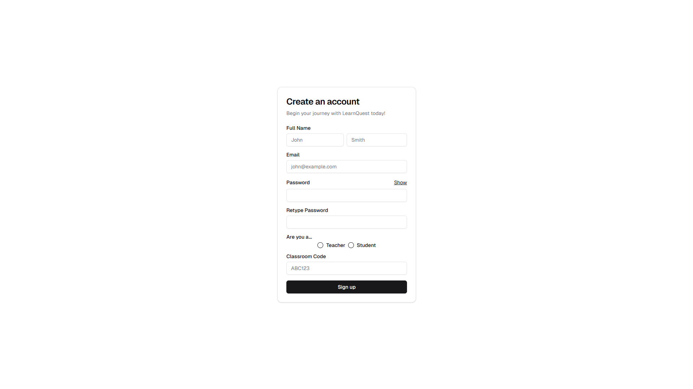
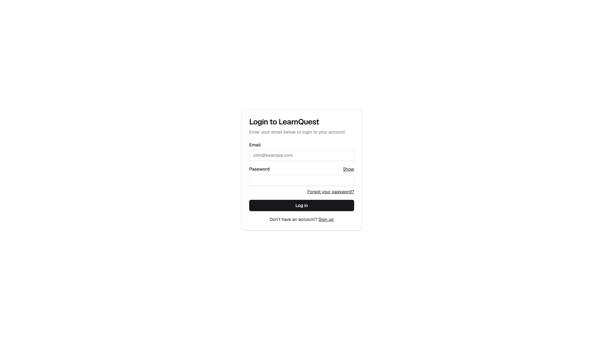
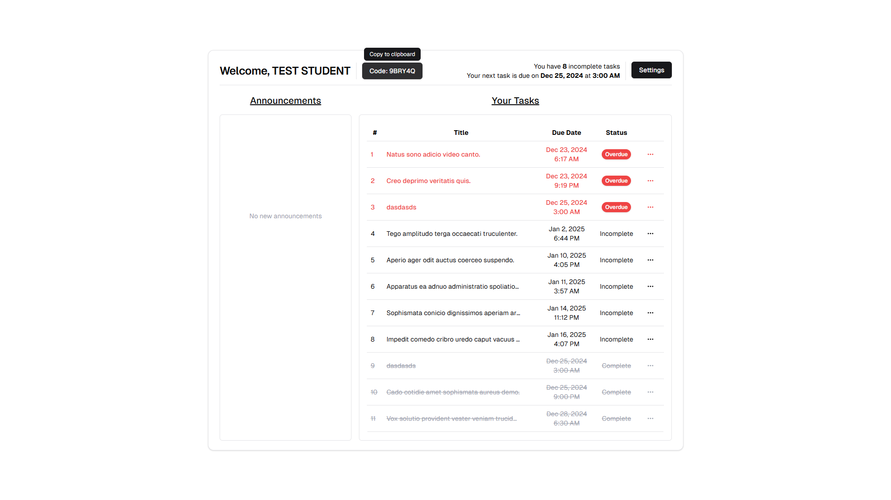
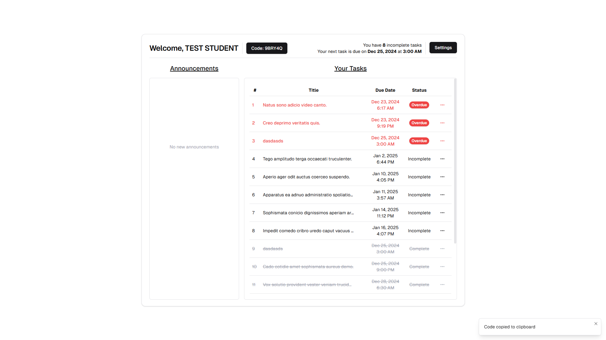
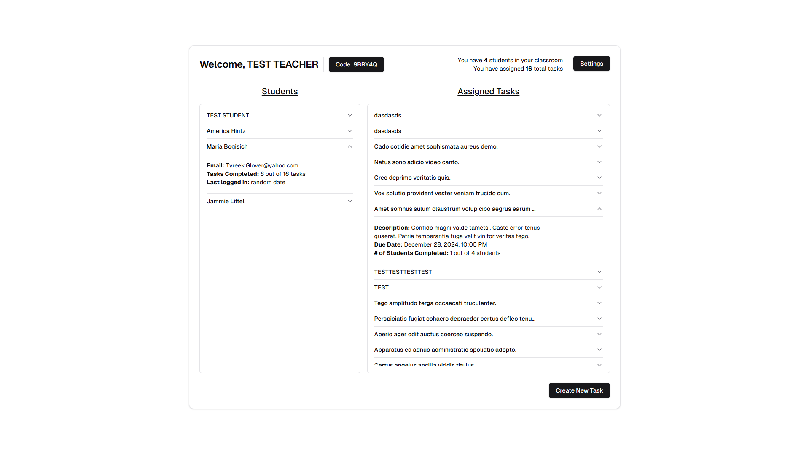
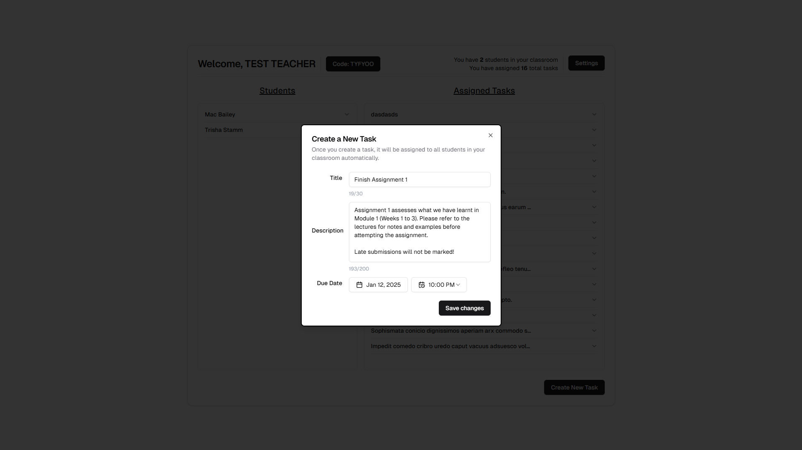
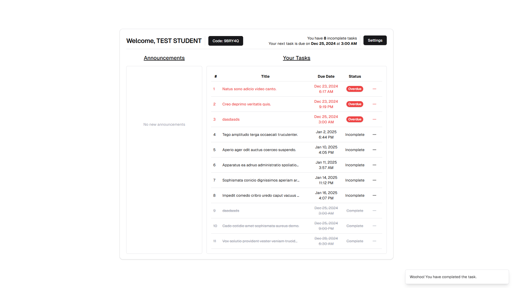
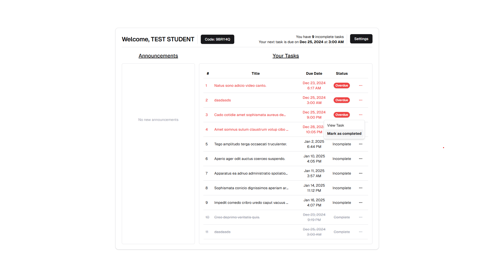

<a id="readme-top"></a>

# About the Project

LearnQuest is an online LMS platform that allows students to learn and teachers to teach. Bootstrapped with Next.js and Convex, this modern and responsive application provides education providers a foundation for managing their classes and students.

Features include:

- User authentication and authorization with [Clerk](https://clerk.com/)
- View and manage your classroom as a teacher
- Manage tasks (e.g., assignments and homeworks) as a techer and student
- Post annoucements as a teacher (work in progress)
- Receive new tasks instantly as a student without needing to refresh the page
- A user-friendly and responsive interface, built with [shadcn UI](https://ui.shadcn.com/) and [Tailwind CSS](https://tailwindcss.com/)

### Built With:

[![Typescript][Typescript]][Typescript-url]
[![Next][Next.js]][Next-url]
[![React][React.js]][React-url]
[![Tailwind CSS][Tailwind CSS]][Tailwind CSS-url]
[![Clerk][Clerk]][Clerk-url]
[![Convex][Convex]][Convex-url]
[![React Hook Form][React Hook Form]][React Hook Form-url]
[![ShadCN UI][ShadCN UI]][ShadCN UI-url]
[![Zod][Zod]][Zod-url]
[![Prettier][Prettier]][Prettier-url]

<p align="right">(<a href="#readme-top">back to top</a>)</p>

<!-- GETTING STARTED -->

## Getting Started

### Prerequisites

You will need [Node.js](https://nodejs.org/en/download/) and [Git](https://git-scm.com/downloads) installed on your machine to run the project.

### Installation

1.  Clone this repo:

```sh
git clone https://github.com/ghxstling/learnquest.git
```

2. Navigate to the repository directory:

```sh
cd learnquest
```

3. Install NPM packages:

```sh
npm install
```

4. Create a .env file in the root directory and add the following environment variables:

```sh
NEXT_PUBLIC_CONVEX_URL= ...
NEXT_PUBLIC_CLERK_PUBLISHABLE_KEY= ...
CLERK_SECRET_KEY= ...
NEXT_PUBLIC_CLERK_SIGN_IN_URL=/login
NEXT_PUBLIC_CLERK_SIGN_UP_URL=/register
```

  <table>
  <tr>
    <th>Variable</th>
    <th>Description</th>
  </tr>
  <tr>
    <td>NEXT_PUBLIC_CONVEX_URL</td>
    <td>
    <a href="https://docs.convex.dev/client/react/deployment-urls">Deployment URL for Convex</a>
    (Requires a Convex account)
    </td> 
  </tr>
  <tr>
    <td>NEXT_PUBLIC_CLERK_PUBLISHABLE_KEY</td>
    <td>
        <a href="https://docs.clerk.dev/">
        Your public API key for Clerk 
        </a> (Requires a Clerk account)
    </td>
  </tr>
  <tr>
    <td>CLERK_SECRET_KEY</td>
    <td>
        <a href="https://docs.clerk.dev/">
        Your secret API key for Clerk
        </a> (Requires a Clerk account)
    </td>
  </tr>
  <tr>
    <td>NEXT_PUBLIC_CLERK_SIGN_IN_URL</td>
    <td>
        The custom sign-in URL Clerk will redirect to rather than their own sign-in page. This must be set to <code>/login</code>.
    </td>
  </tr>
  <tr>
    <td>NEXT_PUBLIC_CLERK_SIGN_UP_URL</td>
    <td>
        The custom sign-up URL Clerk will redirect to rather than their own sign-up page. This must be set to <code>/register</code>.
    </td>
  </tr>
  </table>

5. Install dependencies using npm:

```sh
npm install
```

6. Open two terminals and run the following commands on each terminal:

```sh
npm run dev
```

```sh
npx convex dev
```

7. Navigate to http://localhost:3000/ to view the application in your browser.

8. Create an account as a student or teacher using classroom code <code>A1B2C3</code>

9. (Optional) Alternatively, log in with the following credentials:

```sh
# Teacher
email: gacipot214@gholar.com
password: 12341234

# Student
email: kosope2500@chansd.com
password: 12341234
```

<p align="right">(<a href="#readme-top">back to top</a>)</p>

<!-- USAGE EXAMPLES -->

## Usage

### User and Authentication

- Create an account
  

- Log in
  

- Copy classroom code to clipboard
  
  

### Teachers

- Dashboard view of your classroom
  

- Create new tasks (e.g., assignments and homeworks)
  

### Students

- Dashboard view of your classroom
  

- Mark tasks as complete or incomplete
  
  

<p align="right">(<a href="#readme-top">back to top</a>)</p>

<!-- ROADMAP -->

## Roadmap

- User

  - [ ] Reset own password via email link
  - [ ] Update email address
  - [ ] Request to change user type (e.g., from student to teacher)

- Teacher

  - [ ] Invite students to join a classroom
  - [ ] Create classrooms instead of using pre-generated classroom codes
  - [ ] Post announcements
  - [ ] Delete tasks
  - [ ] Edit tasks

- Students
  - [ ] View announcements
  - [ ] Pin tasks
  - [ ] Set reminders for tasks
  - [ ] Request to join a classroom

<p align="right">(<a href="#readme-top">back to top</a>)</p>

## Creator Information

<a href="https://github.com/ghxstling/learnquest/graphs/contributors">
  
</a>

Dylan Choy: https://ghxstling.info/

Project Link: [https://github.com/ghxstling/learnquest](https://github.com/ghxstling/learnquest)

<p align="right">(<a href="#readme-top">back to top</a>)</p>

<!-- MARKDOWN LINKS & IMAGES -->
<!-- https://www.markdownguide.org/basic-syntax/#reference-style-links -->

[contributors-shield]: https://img.shields.io/github/contributors/ghxstling/learnquest.svg?style=for-the-badge
[contributors-url]: https://github.com/ghxstling/learnquest/graphs/contributors
[forks-shield]: https://img.shields.io/github/forks/ghxstling/learnquest.svg?style=for-the-badge
[forks-url]: https://github.com/ghxstling/learnquest/network/members
[stars-shield]: https://img.shields.io/github/stars/ghxstling/learnquest.svg?style=for-the-badge
[stars-url]: https://github.com/ghxstling/learnquest/stargazers
[issues-shield]: https://img.shields.io/github/issues/ghxstling/learnquest.svg?style=for-the-badge
[issues-url]: https://github.com/ghxstling/learnquest/issues
[license-shield]: https://img.shields.io/github/license/ghxstling/learnquest.svg?style=for-the-badge
[license-url]: https://github.com/ghxstling/learnquest/blob/master/LICENSE.txt
[linkedin-shield]: https://img.shields.io/badge/-LinkedIn-black.svg?style=for-the-badge&logo=linkedin&colorB=555
[linkedin-url]: https://linkedin.com/in/dylan-choy
[product-screenshot]: images/screenshot.png
[Typescript]: https://img.shields.io/badge/TypeScript-007ACC?style=for-the-badge&logo=typescript&logoColor=white
[Typescript-url]: https://www.typescriptlang.org/
[Next.js]: https://img.shields.io/badge/next.js-000000?style=for-the-badge&logo=nextdotjs&logoColor=white
[Next-url]: https://nextjs.org/
[React.js]: https://img.shields.io/badge/React-20232A?style=for-the-badge&logo=react&logoColor=61DAFB
[React-url]: https://reactjs.org/
[Clerk]: https://img.shields.io/badge/Clerk-35495E?style=for-the-badge&logo=clerk
[Clerk-url]: https://clerk.com/
[Tailwind CSS]: https://img.shields.io/badge/Tailwind_CSS-38B2AC?style=for-the-badge&logo=tailwind-css&logoColor=white
[Tailwind CSS-url]: https://tailwindcss.com/
[Convex]: https://img.shields.io/badge/Convex-f73b0c?style=for-the-badge
[Convex-url]: https://convex.dev/
[React Hook Form]: https://img.shields.io/badge/React_Hook_Form-EC5990?style=for-the-badge&logo=reacthookform&logoColor=white
[React Hook Form-url]: https://convex.dev/
[Zod]: https://img.shields.io/badge/zod-3E67B1?style=for-the-badge&logo=zod&logoColor=white
[Zod-url]: https://https://zod.dev/
[ShadCN UI]: https://img.shields.io/badge/shadcnui-000000?style=for-the-badge&logo=shadcnui&logoColor=white
[ShadCN UI-url]: https://ui.shadcn.com/
[Prettier]: https://img.shields.io/badge/prettier-F7B93E?style=for-the-badge&logo=prettier&logoColor=white
[Prettier-url]: https://prettier.io/
